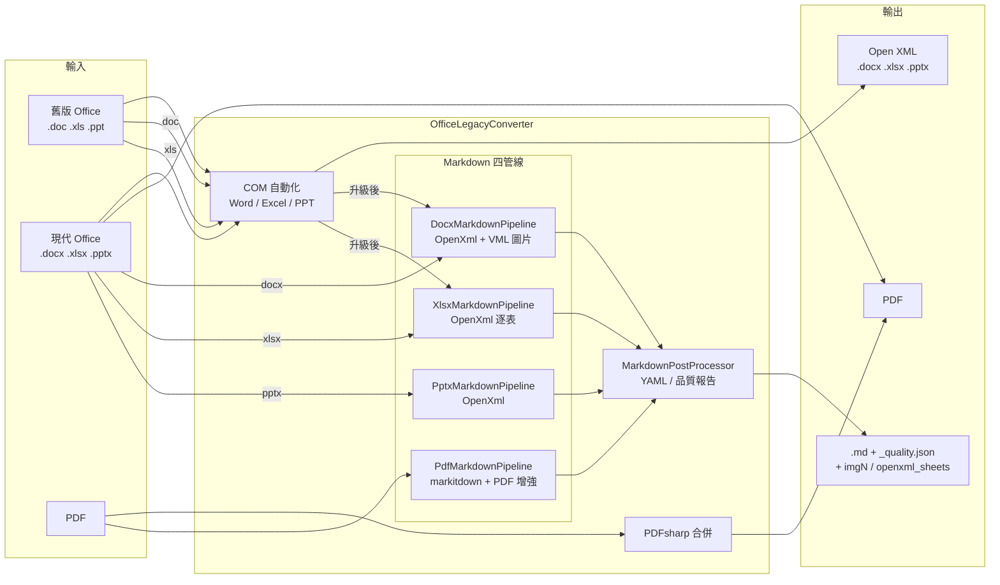
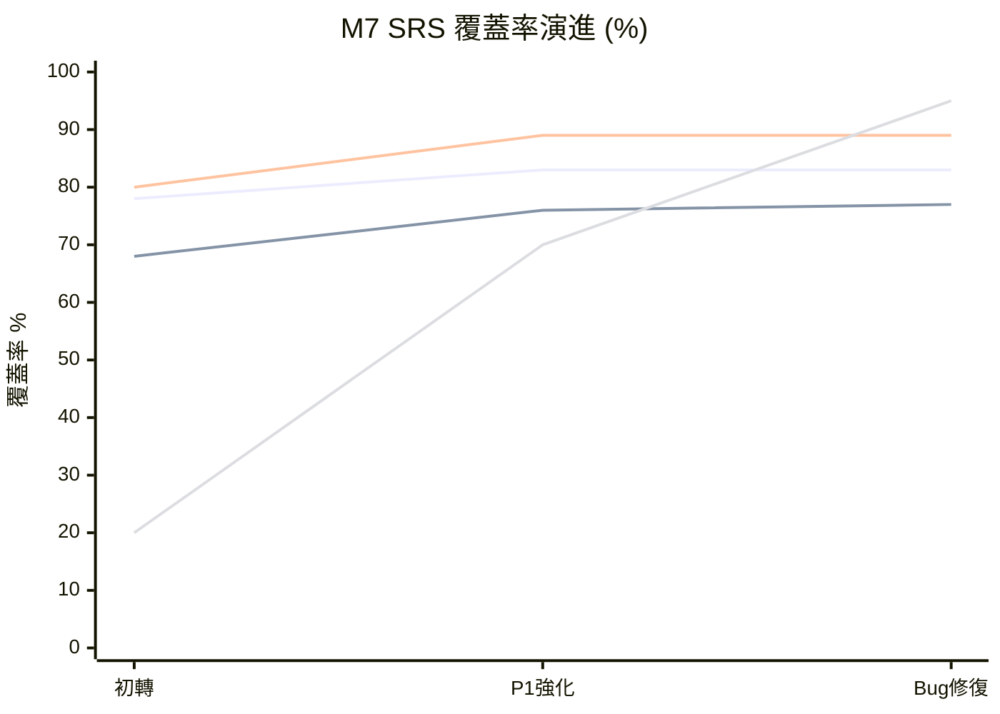
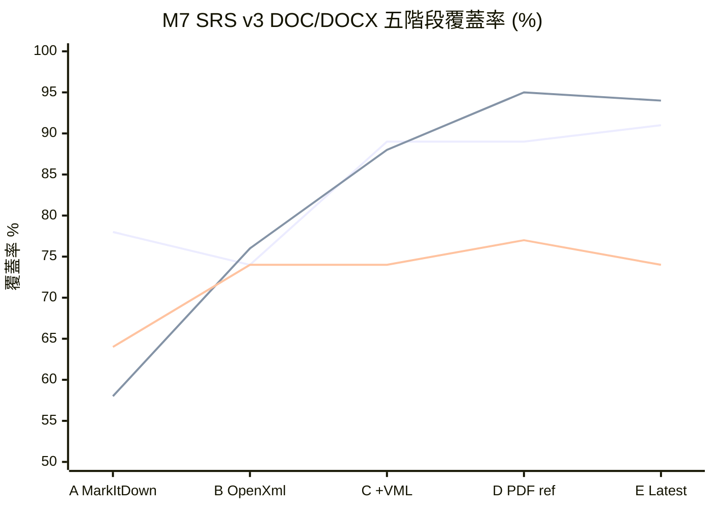
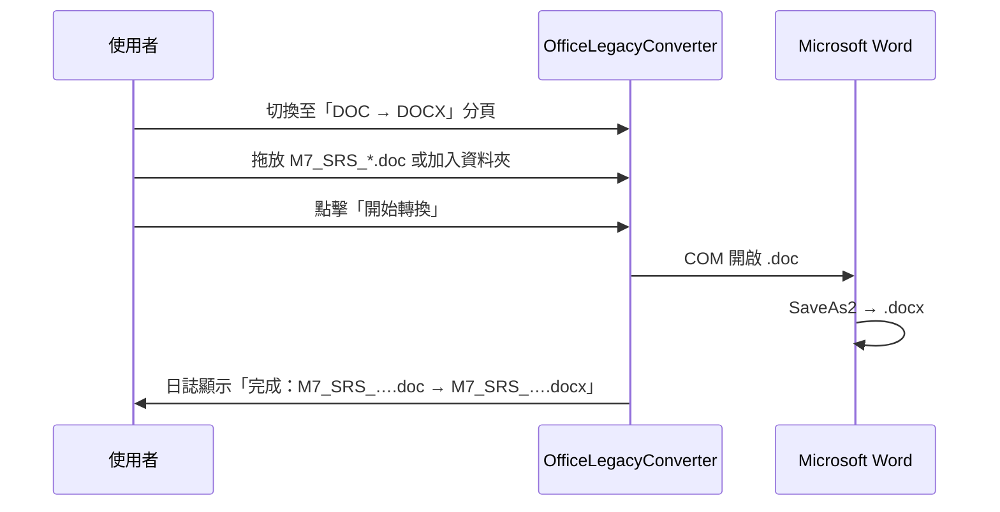
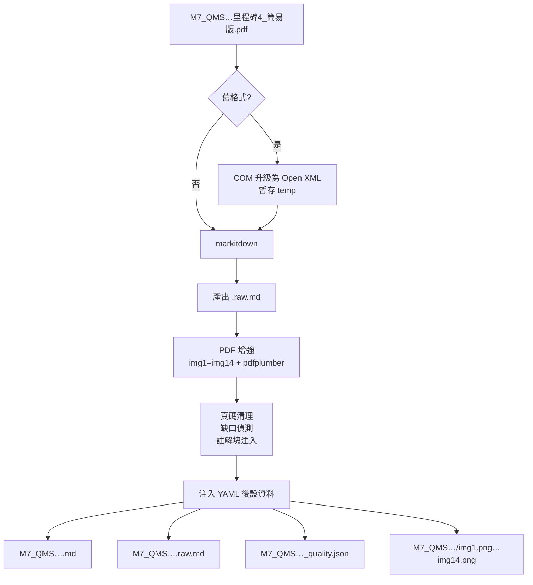
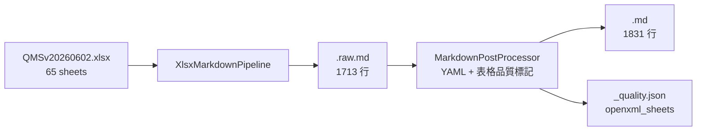
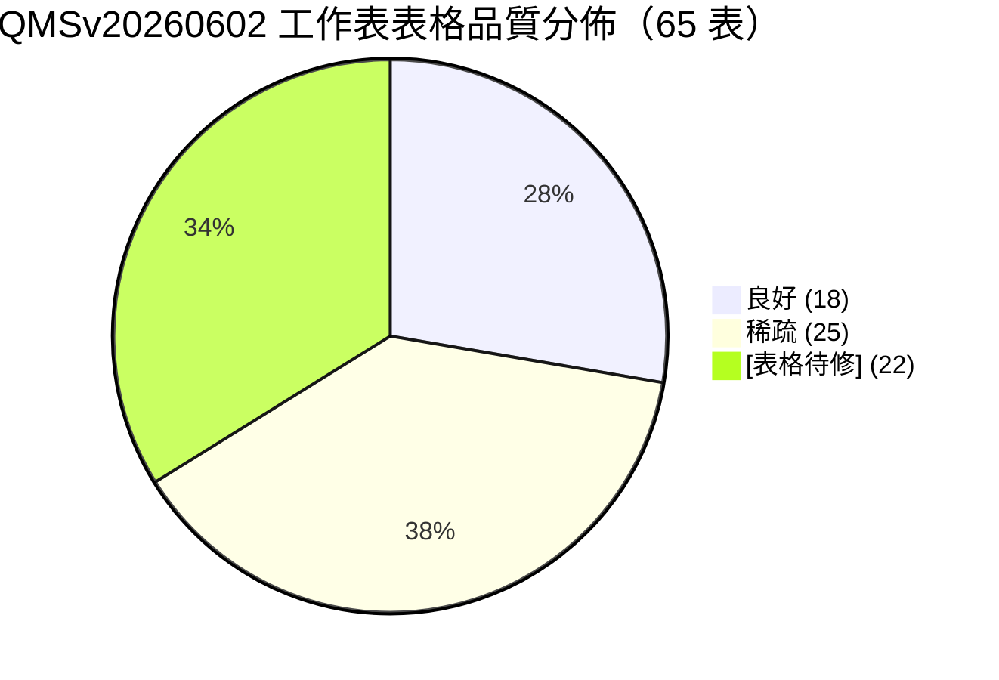
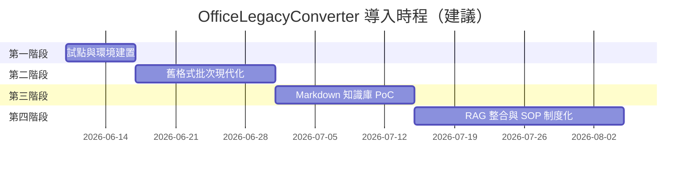

# OfficeLegacyConverter 企業應用價值報告

> **文件版本**：1.3  
> **適用產品**：OfficeLegacyConverter（視窗標題：「Office 舊格式轉換器」）  
> **專案路徑**：`d:\VS\Doc2Docx`  
> **撰寫目的**：向管理層、IT 與業務單位說明此工具的企業價值、功能範圍、M7 SRS 實證數據與 AI 時代導入策略  
> **修訂摘要（v1.3）**：併入 M7 SRS v3 DOC/DOCX 五階段最終驗證（Version A→E scorecard）；補齊 §6.6 QMSv20260602 XLSX 資料字典 65 表實證；更新四管線架構圖與附錄  
> **修訂摘要（v1.2）**：新增 M7 QMS 資料字典 **QMSv20260602.xlsx**（65 工作表）全量 OpenXml 轉換驗證；說明 `XlsxMarkdownPipeline` 與 `_quality.json` 之 `openxml_sheets` 欄位  
> **修訂摘要（v1.1）**：併入 M7 SRS 三次驗證覆蓋率演進；新增完整功能使用手冊與 Markdown 輸出檔案說明

---

## 摘要

**OfficeLegacyConverter** 是一套 Windows 桌面批次轉換工具，以圖形化介面整合六項核心能力：**舊版 Office 格式現代化**（DOC/XLS/PPT → Open XML）、**Word 轉 PDF**、**PDF 合併**，以及面向 AI 知識庫的 **Office/PDF → Markdown** 管線。工具透過本機已安裝的 Microsoft Office COM 自動化確保轉換品質，並以 Microsoft 開源的 **markitdown** 模組將企業文件結構化為 Markdown，再經由內建後處理注入 YAML 後設資料、清理頁碼雜訊、標記已知缺口。

在 AI 普及的今日，企業最大的瓶頸往往不是「沒有 LLM」，而是**知識被鎖在舊格式 Office 檔與掃描 PDF 中，無法被檢索、引用與治理**。本工具以「**不完美但可用**」為設計哲學——不追求 100% 像素級還原，而是快速產出 **Tier-1 原始擷取** 等級的結構化知識，搭配人工註解塊與品質報告，讓 RAG/LLM 專案能在數天內啟動，而非數月。

以 **M7 QMS 軟體需求規格書** 為實證標的，已完成三條驗證軌跡：

| 軌跡 | 標的檔 | 關鍵成果 |
|------|--------|----------|
| **PDF 簡易版** | 里程碑 4（14 頁 PDF） | 三次迭代：語意 ~78%→~83%，可恢復 ~80%→~89%，元資料 ~20%→~95% |
| **DOC/DOCX 完整版 v3** | 完整 SRS（Version E） | 五階段比對（A→E）：可恢復 **~91%**、元資料 **~94%**、22 張外部圖檔、Tier-1 知識庫就緒 |
| **XLSX 資料字典** | QMSv20260602.xlsx | **65/65** 工作表 PASS、`openxml_sheets` 元資料完整對齊 |

Markdown 轉換依副檔名自動路由至四條專用管線：**PdfMarkdownPipeline**、**DocxMarkdownPipeline**、**XlsxMarkdownPipeline**、**PptxMarkdownPipeline**，再統一經 **MarkdownPostProcessor** 注入 YAML 與品質報告。

**建議優先導入場景**：品質管理系統（QMS）規格書批次現代化、QMS 資料字典結構化、舊版 Excel 報表升級、合約 PDF 化送審、多份 PDF 合併，以及 AI 知識庫前置處理（Office → MD → RAG）。

<!-- 截圖：報告封面或主畫面全景 -->

---

## 一、我們面對的問題

### 1.1 格式斷層：舊版 Office 成為數位化障礙

許多企業仍保有大量 **Word 97–2003（.doc）**、**Excel 97–2003（.xls）**、**PowerPoint 97–2003（.ppt）** 檔案。這些檔案在新版 Office、雲端協作平台（SharePoint、Teams）、以及多數文件解析工具中，常出現相容性警告、版面跑版或無法開啟等問題。

### 1.2 知識孤島：文件無法進入 AI 管線

企業導入 Copilot、內部 RAG 聊天機器人或知識庫時，普遍面臨：

| 痛點 | 具體表現 |
|------|----------|
| 格式阻擋 | LLM 與向量資料庫偏好純文字或 Markdown，Office 二進位檔難以直接嵌入 |
| 批次成本 | 手動另存新格式、複製貼上到 Wiki，耗時且易出錯 |
| 技術門檻 | IT 提供的 PowerShell/COM 腳本，業務與品保人員不敢自行執行 |
| 品質不透明 | 轉換後不知哪些章節缺圖、表格破碎，AI 容易「腦補」錯誤答案 |
| 稽核需求 | 合約、規格書需 PDF 定版，但缺乏一鍵批次工具 |

### 1.3 腳本與人工並存的隱性成本

過去常見解法包括：單檔手動另存、VBA 巨集、PowerShell 呼叫 Word COM、或請 IT 寫一次性腳本。這些方式在**少量檔案**時可行，但當面對數百份 QMS 規格書、歷年報表或專案交付文件時，缺乏統一介面、進度回饋與錯誤隔離機制，導致專案延期與重工。

---

## 二、這個工具是什麼

**OfficeLegacyConverter** 是基於 **.NET 10 Windows Forms** 開發的單機桌面應用程式，執行檔名稱為 `OfficeLegacyConverter.exe`。它以**分頁式介面**將六類轉換任務集中於同一視窗，支援拖放、資料夾遞迴掃描、批次處理、即時日誌與取消操作。

### 2.1 設計定位



### 2.2 核心設計原則

1. **沿用 Office 引擎**：格式轉換透過本機 Word/Excel/PowerPoint COM，最大限度保留原始排版與嵌入物件。
2. **批次優先**：清單可累積多檔或整個資料夾，單檔失敗不阻斷其餘檔案。
3. **可觀測**：進度列、狀態計數與文字日誌，便於稽核與除錯。
4. **AI 就緒**：Markdown 管線產出帶 YAML 後設資料的結構化文本，並附品質 JSON，支援後續 RAG 分塊與人工精煉。
5. **不完美但可用**：接受自動轉換的侷限（圖片、複雜表格），以標記與缺口清單取代沉默失敗。

### 2.3 Markdown 管線架構（v1.3 四管線）

`MarkdownPipeline` 依副檔名路由至四條獨立管線，再統一進入 `MarkdownPostProcessor`：

| 管線檔 | 輸入格式 | 轉換引擎 | `_quality.json` 專屬欄位 |
|--------|----------|----------|-------------------------|
| `PdfMarkdownPipeline.cs` | `.pdf` | markitdown + PDF 增強 | `pdf_enhancement` |
| `DocxMarkdownPipeline.cs` | `.doc`、`.docx` | **OpenXml**（`DocxMarkdownConverter`） | `openxml_images` |
| `XlsxMarkdownPipeline.cs` | `.xls`、`.xlsx` | **OpenXml**（`XlsxMarkdownConverter`） | `openxml_sheets` |
| `PptxMarkdownPipeline.cs` | `.ppt`、`.pptx` | OpenXml | — |

**DocxMarkdownPipeline** 直接解析 DOCX 內容，支援 DrawingML／**VML** 內嵌圖片匯出為外部 `imgN` 檔（取代 MarkItDown 的 base64 內嵌）；**ZipArchive** 讀取修復確保大型 DOCX 穩定解析。**XlsxMarkdownPipeline** 逐工作表輸出 `## {工作表名稱}` 區段。詳見附錄 B.7、B.8。

---

## 三、功能總覽

### 3.1 六大分頁一覽

| 分頁名稱 | 輸入格式 | 輸出格式 | 底層技術 | 典型用途 |
|----------|----------|----------|----------|----------|
| **DOC → DOCX** | `.doc` | 同目錄 `.docx` | Word COM（格式代碼 12） | 舊版規格書、合約現代化 |
| **XLS → XLSX** | `.xls` | 同目錄 `.xlsx` | Excel COM（格式代碼 51） | 歷年報表、成本試算表升級 |
| **PPT → PPTX** | `.ppt` | 同目錄 `.pptx` | PowerPoint COM（格式代碼 24） | 教育訓練、簡報典藏 |
| **DOCX → PDF** | `.docx` | 同目錄 `.pdf` | Word COM（格式代碼 17） | 送審定版、對外發行 |
| **PDF 合併** | 多個 `.pdf`（順序可調） | 單一 `.pdf` | PDFsharp 6.2 | 合併附件、組裝送審包 |
| **轉 Markdown** | `.pdf` `.doc` `.docx` `.xls` `.xlsx` `.ppt` `.pptx` | 輸出資料夾內 `.md` 等 | 格式分派管線¹ + 後處理 | AI 知識庫、全文檢索前置 |

¹ **`.pdf`** → `PdfMarkdownPipeline`（markitdown）；**`.doc`/`.docx`** → `DocxMarkdownPipeline`（OpenXml）；**`.xlsx`** → `XlsxMarkdownPipeline`（OpenXml）；**`.ppt`/`.pptx`** → `PptxMarkdownPipeline`。`_quality.json` 依格式寫入 `pdf_enhancement`、`openxml_images` 或 `openxml_sheets`。

<!-- 截圖：主畫面六分頁 Tab 列 -->

### 3.2 各分頁操作概要

各分頁的完整逐步操作說明，請參閱本報告 **第十一章「功能使用手冊」**。以下為快速參考：

| 分頁 | 加入方式 | 輸出位置 | 特殊選項 |
|------|----------|----------|----------|
| DOC/XLS/PPT → 新格式 | 檔案、資料夾、拖放 | 同目錄替換副檔名 | 刪除原始檔、顯示 Office |
| DOCX → PDF | 同上 | 同目錄 `.pdf` | 同上 |
| PDF 合併 | 檔案、拖放 | 指定路徑 | 上移／下移調序 |
| 轉 Markdown | 檔案、資料夾、拖放 | 指定輸出資料夾 | 刪除原始檔、顯示 Office（升級舊格式） |

### 3.3 Markdown 轉換輸出檔案概要

「轉 Markdown」分頁完成後，每份來源檔於輸出資料夾產生下列資產（PDF 範例）：

| 檔案／資料夾 | 角色 |
|--------------|------|
| **`.pdf`（原始檔）** | 權威來源；表格、圖片、簽核以 PDF 為準 |
| **`{主檔名}.raw.md`** | markitdown 原始輸出，供比對與除錯 |
| **`{主檔名}.md`** | 主要工作檔：YAML 後設資料 + 清理後正文 + 註解標記 |
| **`{主檔名}_quality.json`** | 品質稽核／修補待辦清單（PDF 含 `pdf_enhancement`；**XLSX 含 `openxml_sheets`**） |
| **`{主檔名}/img1.png`～`imgN.png`** | PDF 逐頁匯出圖；正文以 **【imgN】** 標記引用 |

完整說明見 **第六章 M7 實例**（含 §6.6 資料字典驗證）與 **附錄 B：輸出檔案說明**。

<!-- 截圖：Markdown 轉換四種輸出檔與 img 資料夾並列 -->

### 3.4 共用介面元件

| 元件 | 說明 |
|------|------|
| 檔案清單（ListBox） | 顯示完整路徑，支援多選、拖放 |
| 進度列 | 顯示目前處理進度（x / 總數） |
| 狀態標籤 | 就緒 / 完成 / 已取消 / 錯誤 |
| 日誌區（唯讀） | 逐步記錄每個檔案的處理結果與清理動作 |
| 取消按鈕 | 轉換進行中可中斷（含終止 Python 子程序） |

批次完成時，程式會彈出 **MessageBox**：「已成功處理 N 個檔案。」（PDF 合併亦同，N 為輸入 PDF 數量）。

---

## 四、在 AI 時代的價值

### 4.1 舊格式解鎖：讓歷史資產進入現代工作流

AI 工具鏈（Embedding、RAG、Agent）普遍假設輸入為**可解析文字**。舊版 `.doc`/`.xls` 常讓 markitdown、LangChain 文件載入器等第一步就失敗。本工具在 Markdown 管線中**內建舊格式升級**，使用者無需手動兩階段操作，即可將封存十年的規格書直接送入知識管線。

### 4.2 知識庫建置：PDF/Office → Markdown → RAG

```mermaid
flowchart TB
    subgraph Tier-1 自動擷取
        S1[Office / PDF 原始檔]
        S2[markitdown 轉換]
        S3[.raw.md 原始輸出]
        S4[後處理：頁碼清理<br/>缺口偵測]
        S5[.md + YAML 後設資料]
        S6[_quality.json 品質報告]
        S7[{basename}/imgN.png]
    end

    subgraph Tier-2 人工精煉
        H1[品保 / 工程師審閱]
        H2[補充 圖片補足 / 待補 標記]
        H3[refinement.status → reviewed]
    end

    subgraph Tier-3 AI 應用
        R1[分塊 Chunking]
        R2[向量資料庫]
        R3[RAG 問答 / Copilot  grounding]
    end

    S1 --> S2 --> S3 --> S4 --> S5
    S4 --> S6
    S4 --> S7
    S5 --> H1 --> H2 --> H3
    H3 --> R1 --> R2 --> R3
```

產出的 `.md` 檔案包含：

- **來源追溯**：`source_file`、`source_path`、`converted_date`
- **知識分級**：`knowledge_tier: 1`（原始擷取）
- **品質聲明**：`semantic_coverage` 註明待人工評估
- **已知缺口**：`known_gaps` 列出空白章節、破碎表格、缺圖等
- **LLM 使用指引**：明確要求「遇到標記不得腦補」「引用需註明章節」

這使 AI 專案負責人能在 ingest 階段就建立**治理規則**，降低幻覺風險。

### 4.3 降低 PowerShell / 技術門檻

| 對比維度 | 純腳本方案 | OfficeLegacyConverter |
|----------|------------|----------------------|
| 操作介面 | 命令列、需編輯路徑 | 圖形化、拖放即可 |
| 批次管理 | 自行處理迴圈與錯誤 | 內建清單、單檔錯誤隔離 |
| 進度可見性 | 通常僅文字輸出 | 進度列 + 即時日誌 |
| 舊格式 + MD | 需串接兩套腳本 | 單一分頁一鍵完成 |
| 品質報告 | 需自行開發 | 內建 `_quality.json` |
| 推廣對象 | 僅 IT | 品保、專案管理、文管皆可 |

### 4.4 人工註解塊 + YAML 後設資料的企業知識精煉

後處理器會將 PDF 轉換常見的**幽靈頁碼**、**表格幽靈列**自動清理，並將「參考資料」區段的缺圖轉為標準化區塊：

```markdown
> **[圖片補足：p.12 見原始 PDF]**
> - 狀態：自動轉換未擷取圖片，請對照 source_file 原圖補充
> - 置信度：待人工補充
```

對 QMS 規格書常見結構（如 `(3) 資料來源`、`(4) 需求說明 A.`），工具會自動偵測空白段落並寫入 `known_gaps`，供品保工程師優先審閱。**「不完美但可用」** 意味著：寧可明確標記不確定之處，也不讓 AI 把頁碼或空表格當成正式需求。

M7 SRS 實證中，後處理共插入 **[待補]×2**（1.1.2、1.1.3 空白資料來源）、**[表格待修]×67**、**[圖片補足]×15**，並於文末附加 **【img1】–【img14】** 圖片索引，使缺口對人類與 LLM 皆可見。

---

## 五、典型使用場景

### 場景一：QMS 規格書批次轉換

**對象**：品保部門、驗證工程師  
**痛點**：數百份 `.doc` 規格書（SRS）散落於各產品線資料夾，無法上傳至新版文件管理系統。  
**作法**：使用 **DOC → DOCX** 分頁，「加入資料夾」遞迴掃描，批次升級為 `.docx`。  
**效益**：一次性解決相容性，後續可搭配 SharePoint、Confluence 或 Markdown 管線。

### 場景二：舊版 Excel 報表現代化

**對象**：財務、營運、製造部門  
**痛點**：歷年 `.xls` 報表在新版 Excel 開啟時出現相容模式警告，巨集與圖表行為不一致。  
**作法**：**XLS → XLSX** 分頁批次轉換，保留於原目錄便於對照。  
**效益**：報表可接入 Power BI、Python 分析或 AI 數據助理。

### 場景三：合約 / 文件 PDF 化

**對象**：法務、專案管理、業務  
**痛點**：Word 定稿需轉 PDF 外發或歸檔，手動另存耗時。  
**作法**：**DOCX → PDF** 分頁，批次產出同目錄 PDF。密碼保護檔勾選「顯示 Word 視窗」輸入密碼。  
**效益**：標準化定版流程，減少人為疏忽。

### 場景四：多份 PDF 合併送審

**對象**：專案管理、品保送審  
**痛點**：主管機關或客戶要求單一 PDF 套組，內含規格書、測試報告、附件。  
**作法**：**PDF 合併** 分頁，依送審順序排列後合併為 `merged.pdf` 或自訂檔名。  
**效益**：無需 Adobe 或其他付費工具，本機快速完成。

### 場景五：AI 知識庫前置處理

**對象**：IT、數位轉型團隊、Copilot 專案負責人  
**痛點**：RAG 專案卡在「文件從哪來、格式怎麼統一」。  
**作法**：**轉 Markdown** 分頁，將 QMS 規格 PDF、Word、簡報一次轉為 `.md`，依 `_quality.json` 安排人工補圖與表格修復，再送入向量庫。  
**效益**：縮短 PoC 週期，知識具可追溯性與缺口透明度。M7 SRS 實證顯示，可恢復覆蓋率達 ~88–90%，足以支撐 Tier-1 知識庫 PoC。

<!-- 截圖：五種場景對應的分頁示意（可拼貼） -->

---

## 六、M7 SRS 實例演示

以下以 **M7 產品線** 三類實證標的示範知識擷取流程：

1. **SRS 規格書（PDF 簡易版）**（§6.0.1～§6.0.5）：`M7_QMS系統需求規格書(SRS)_里程碑4_簡易版.pdf`，14 頁，章節 1.1.1～1.1.5。
2. **SRS 規格書（DOC/DOCX 完整版 v3）**（§6.0.6、§6.5）：完整 SRS 經 `DocxMarkdownPipeline` 五階段比對（Version A→E），最終 **Version E** 為生產基準。
3. **資料字典**（§6.6）：`QMSv20260602.xlsx`，65 個工作表——經 `XlsxMarkdownPipeline` 全量轉換驗證。

### 6.0 M7 SRS 實證：覆蓋率演進

#### 6.0.1 PDF 簡易版三次驗證（2026-06-11）

本小節彙整 PDF 軌跡三次迭代的量化比對結果。

##### 三階段覆蓋率總表

| 驗證階段 | 時間點 | 語意覆蓋 | 結構可用 | 可恢復覆蓋¹ | 元資料可信度 | 頁碼污染 |
|---------|--------|---------|---------|------------|------------|---------|
| **① 初轉（P1 前）** | 第一次比對 | **~78%** | **~68%** | ~80% | ~20% | ~60% 乾淨 |
| **② P1 強化後** | pdfplumber + img1–14 | **~82–84%** | **~75–77%** | **~88–90%** | ~70% | ~95% 乾淨 |
| **③ Bug 修復後** | 最新驗證 | **~82–84%** | **~76–78%** | **~88–90%** | **~95%** | **100% 乾淨** |

¹ **可恢復覆蓋** = 文字 + 頁面圖 img1–img14 + pdfplumber 備選表，人工或 LLM 可補全的比例。

##### 覆蓋率趨勢圖



<!-- 截圖：M7 SRS 覆蓋率演進圖表（可自 mermaid 匯出） -->

##### 覆蓋率分項評分（Bug 修復後）

| 項目 | 初轉 | P1 強化 | Bug 修復後 | 說明 |
|------|------|---------|-----------|------|
| 章節覆蓋（1.1.1～1.1.5） | 100% | 100% | 100% | 五個需求項皆有對應段落 |
| 正文文字擷取 | ~85% | ~85% | ~85% | markitdown 核心輸出 |
| 表格結構 | ~55% | ~55% | ~55% | 複雜合併儲存格仍易破碎 |
| 表格語意（含 pdfplumber 備選） | — | ~65% | ~65% | 32 處備選表可對照修復 |
| 圖片／參考資料 | ~5% | ~95% | ~95% | P1 起全頁 PNG + 【imgN】 |
| 元資料／traceability | ~20% | ~70% | **~95%** | Bug 修復後 statistics 正確 |
| 頁碼污染 | ~40% 殘留 | ~5% 殘留 | **0% 殘留** | 孤立頁碼 12 已清除 |

##### 三項 Bug 修復驗證

P1 強化後發現三項後處理缺陷，均已修復並通過最終驗證：

| Bug | 修復前現象 | 修復後 | 狀態 |
|-----|-----------|--------|------|
| **#1 quality.json 統計** | `pages_exported: 0`、`image_paths: []` | 14 頁／32 表／14 圖路徑正確 | ✅ PASS |
| **#2 1.1.1 空白誤報** | gaps 誤標 1.1.1 資料來源空白 | 僅 1.1.2、1.1.3 標 [待補]；1.1.1 保留完整 ERP 文字 | ✅ PASS |
| **#3 孤立頁碼 `12`** | `.md` 參考資料後殘留獨立 `12` 行 | cleanup 清除，0 處殘留 | ✅ PASS |

<!-- 截圖：Bug 修復前後 _quality.json 統計欄位對照 -->

##### 「不完美但可用」哲學在 PDF 簡易版的體現

| 設計取捨 | M7 實證表現 | 企業意義 |
|----------|------------|----------|
| 不追求 100% 表格還原 | 67 處 [表格待修] + 32 處 pdfplumber 備選 | 缺口可見，修補有優先序 |
| 明確標記空白段落 | 1.1.2、1.1.3 [待補：(3) 資料來源] | LLM 不會腦補不存在的來源 |
| 頁面圖而非 OCR 全文 | img1–img14 對應 14 頁 | WMS 截圖（p.11）可視覺對照 |
| YAML + llm_instructions | 59 行 front matter | RAG 系統提示詞可引用治理規則 |

#### 6.0.6 DOC/DOCX 完整版 v3：五階段最終驗證（Version A→E）

以完整 M7 SRS v3 `.docx` 為標的，歷經五版轉換策略比對，最終 **Version E（Latest）** 為 `DocxMarkdownPipeline` 生產基準。

##### 五階段覆蓋率 scorecard

| Version | 語意 Semantic | 結構 Structural | 可恢復 Recoverable | 元資料 Metadata | 圖片 Images | [待補] |
|---------|--------------|-----------------|-------------------|-----------------|-------------|--------|
| **A** MarkItDown | ~89% | ~64% | ~78% | ~58% | 22 base64 | 0 |
| **B** OpenXml 無 VML | ~90% | ~74% | ~74% | ~76% | 0 | 0 |
| **C** +VML | ~90% | ~74% | ~89% | ~88% | 22 files | 0 |
| **D** PDF 簡易版 ref | ~83% | ~77% | ~89% | ~95% | 14 PNG | 2 |
| **E** Latest | **~90%** | **~74%** | **~91%** | **~94%** | **22 files** | **4** |

##### A→E 累計改善（Version E 相對 Version A）

| 維度 | 改善幅度 | 說明 |
|------|----------|------|
| 可恢復覆蓋 | **+12～14%**（78%→91%） | VML 圖片外置 + 資料來源偵測 |
| 元資料可信度 | **+35～37%**（58%→94%） | `openxml_images`、statistics 正確 |
| 結構可用 | **+10%**（64%→74%） | OpenXml 直轉優於 MarkItDown |
| 圖片呈現 | base64 → **22 外部檔** | img1–img22（21 PNG + 1 EMF） |
| 缺口標記 | — | 4 處 [待補：資料來源]（章節 2.8、6.12、6.13、6.16） |
| 表格品質 | — | 37 處 [表格待修]、10 項 quality gaps |

##### Version E 架構要點

| 元件 | 功能 |
|------|------|
| `DocxMarkdownPipeline` | 路由 `.doc`/`.docx`，舊格式先 COM 升級 |
| `DocxMarkdownConverter` | OpenXml 正文擷取 + DrawingML/VML 圖片匯出 |
| VML 修復 | 舊版 Word 內嵌圖（EMF 等）正確解析 |
| 資料來源偵測 | `(3) 資料來源` 空白段落 → `[待補]` + `known_gaps` |
| ZipArchive 修復 | 大型 DOCX 穩定讀取，避免串流截斷 |



> **整體判定（Version E）：** M7 SRS v3 DOC/DOCX 管線已達 **Tier-1 知識庫就緒**（附表格人工修復 caveat：37 處 [表格待修] 需 Tier-2 精煉）。剩餘為內容層修補，非程式缺陷。

### 6.1 前置條件

| 項目 | 要求 |
|------|------|
| 作業系統 | Windows 10 或以上 |
| Microsoft Office | 已安裝 Word（處理 .doc 升級） |
| Python | 3.10 或以上，`pip install markitdown`；PDF 增強另需 `pymupdf`、`pdfplumber` |
| 範例檔案 | `M7_QMS系統需求規格書(SRS)_里程碑4_簡易版.pdf`（14 頁） |

### 6.2 流程 A：格式現代化（僅 DOC → DOCX）



**操作步驟**：

1. 啟動 `OfficeLegacyConverter.exe`。
2. 選擇 **DOC → DOCX** 分頁。
3. 將 `M7_SRS_*.doc` 拖入清單（或「加入資料夾」掃描整個 `QMS\M7\SRS\`）。
4. 確認**未勾選**「刪除原始檔」（首次建議保留備份）。
5. 點擊 **開始轉換**，等待日誌顯示完成與完成 MessageBox。

<!-- 截圖：M7 SRS 檔案加入 DOC 分頁清單 -->

### 6.3 流程 B：AI 知識庫擷取（轉 Markdown）



**操作步驟**：

1. 切換至 **轉 Markdown** 分頁，確認日誌顯示：`就緒：py -3（Python 3.x.x），markitdown 可用`。
2. 加入 `M7_QMS系統需求規格書(SRS)_里程碑4_簡易版.pdf`（或已升級的 `.docx`）。
3. 設定輸出資料夾，例如：`D:\KnowledgeBase\M7\SRS\`。
4. 若來源含密碼，勾選「顯示 Office 視窗（升級舊格式時）」。
5. 點擊 **開始轉換**。
6. 檢視日誌，例如：
   - `PDF 增強：已擷取 14 頁圖片、32 個表格`
   - `清理：刪除獨立頁碼行：12`
   - `清理：參考資料：頁碼 11 → 圖片補足占位`
   - `偵測到 7 個已知缺口（見 _quality.json）`

<!-- 截圖：M7 SRS Markdown 轉換進行中的日誌畫面 -->

### 6.4 產出檔案結構（M7 範例）

#### 6.4.1 PDF 簡易版（14 頁）

```text
D:\KnowledgeBase\M7\SRS\
├── M7_QMS系統需求規格書(SRS)_里程碑4_簡易版.md
├── M7_QMS系統需求規格書(SRS)_里程碑4_簡易版.raw.md
├── M7_QMS系統需求規格書(SRS)_里程碑4_簡易版_quality.json
└── M7_QMS系統需求規格書(SRS)_里程碑4_簡易版\
    ├── img1.png … img14.png   ← PDF 逐頁
```

| 檔案 | 用途 |
|------|------|
| `.pdf`（原始） | **權威來源**；表格、UI 截圖、簽核以 PDF 為準 |
| `.raw.md` | markitdown 原始輸出（489 行） |
| `.md` | 主要知識資產（1,160 行）；含 YAML、【imgN】、註解塊 |
| `_quality.json` | `pdf_enhancement`：14 頁／32 表／14 圖；gaps 7 項 |

#### 6.4.2 DOC/DOCX 完整版 v3（Version E）

```text
D:\KnowledgeBase\M7\SRS\
├── M7_QMS系統需求規格書(SRS)_v3.md
├── M7_QMS系統需求規格書(SRS)_v3.raw.md
├── M7_QMS系統需求規格書(SRS)_v3_quality.json
└── M7_QMS系統需求規格書(SRS)_v3\
    ├── img1.png … img21.png
    └── img22.emf              ← VML 內嵌圖
```

| 檔案 | 用途 |
|------|------|
| `.docx`（原始） | **權威來源**；完整 SRS 全文章節 |
| `.raw.md` | `DocxMarkdownConverter` OpenXml 原始輸出 |
| `.md` | Version E 治理後正文；含 4 處 [待補]、37 處 [表格待修] |
| `_quality.json` | `openxml_images`：22 張圖路徑與 export_log；`conversion_engine: OpenXml` |
| `{basename}/imgN.*` | 22 外部圖檔；正文以 **【imgN】** 引用 |

#### 6.4.3 XLSX 資料字典（QMSv20260602）

```text
D:\KnowledgeBase\M7\
├── QMSv20260602.md
├── QMSv20260602.raw.md
└── QMSv20260602_quality.json    ← openxml_sheets.count = 65
```

**建議使用流程：** 讀 `_quality.json` → 開 `.md` 修 → 對原始 Office 核對 → 不確定時查 `.raw.md` → 修完將 YAML `refinement.status` 改為 `reviewed`。

<!-- 截圖：M7 SRS 產出資料夾結構（含 img 子資料夾） -->
<!-- 截圖：M7 SRS 產出的 .md 檔案開頭 YAML 區塊 -->

### 6.5 驗證結果摘要

#### 6.5.1 PDF 簡易版（里程碑 4）

| 驗證項目 | 結果 |
|----------|------|
| img1–img14 與 PDF 14 頁 | ✅ 一一對應 |
| 【imgN】標記 + 圖片索引 | ✅ 14 個完整 |
| [待補] 標記 | ✅ 2 處（1.1.2、1.1.3 資料來源） |
| [表格待修] + pdfplumber 備選 | ✅ 67 處標記、32 處備選表 |
| [圖片補足] | ✅ 15 處（含 p.11 參考資料） |
| `.md` vs `.raw.md` | +671 行（YAML、註解、索引、備選表） |
| 三項 Bug 修復 | ✅ 全部 PASS |

**章節覆蓋（5 個需求項）：**

| 章節 | 標題 | 狀態 |
|------|------|------|
| 1.1.1 | LRR 排名、不合格大類 | ✅ 完整（含資料來源） |
| 1.1.2 | DMR 處理效率 | ⚠️ 資料來源空白 + [待補] |
| 1.1.3 | DMR 異常分析 | ⚠️ 資料來源空白 + [待補] |
| 1.1.4 | 每月急件占比日報表 | ⚠️ 多表破碎 |
| 1.1.5 | 每月檢驗達成率 & Loading | ⚠️ 參考資料含圖（img11 可對照） |

#### 6.5.2 DOC/DOCX 完整版 v3（Version E 最終 scorecard）

| 驗證項目 | 結果 |
|----------|------|
| 語意覆蓋 Semantic | ✅ ~90% |
| 結構可用 Structural | ✅ ~74% |
| 可恢復覆蓋 Recoverable | ✅ ~91%（A→E +12～14%） |
| 元資料 Metadata | ✅ ~94%（A→E +35～37%） |
| 內嵌圖片 | ✅ 22 外部檔（img1–img22；21 PNG + 1 EMF） |
| [待補：資料來源] | ⚠️ 4 處（章節 2.8、6.12、6.13、6.16） |
| [表格待修] | ⚠️ 37 處（需 Tier-2 人工修復） |
| quality gaps | ⚠️ 10 項（見 `_quality.json`） |
| Tier-1 知識庫就緒 | ✅（附表格手動修復 caveat） |
| 管線架構 | ✅ DocxMarkdownPipeline + VML + 資料來源偵測 + ZipArchive |

<!-- 截圖：M7 SRS 驗證結果摘要表（可後製） -->

### 6.6 M7 QMS 資料字典實證：QMSv20260602.xlsx

本節補充 **Excel 資料字典** 類知識資產的轉換驗證，與 §6.0～§6.5 的 PDF SRS 實證互補：前者驗證「需求敘述」擷取，後者驗證「資料表欄位定義」能否批次結構化供 RAG／Copilot 引用。

#### 6.6.1 來源與轉換設定

| 項目 | 值 |
|------|-----|
| 來源檔 | `QMSv20260602.xlsx` |
| 工作表總數 | **65**（含索引表 LIST；**0 個隱藏工作表**） |
| 轉換引擎 | **OpenXml**（`XlsxMarkdownConverter`，非 markitdown） |
| 管線 | `XlsxMarkdownPipeline.cs`（自單體 `MarkdownPipeline` 重構拆分） |
| 驗證日期 | 2026-06-11 |
| 輸出 | `QMSv20260602.md`、`QMSv20260602.raw.md`、`QMSv20260602_quality.json` |



#### 6.6.2 工作表轉換驗證摘要

| 驗證項目 | 預期 | 實測 | 結果 |
|----------|------|------|------|
| 工作表全數轉換 | 65 / 65 | 65 / 65 | ✅ **PASS** |
| `.md` 標題與來源工作表名一致 | 無遺漏、無多餘 | `missing: []`、`extra: []` | ✅ **PASS** |
| `.raw.md` 標題與來源一致 | 同上 | 同上 | ✅ **PASS** |
| `openxml_sheets.count` | 65 | 65 | ✅ **PASS** |
| `openxml_sheets.sheet_names` | 與 xlsx 一致 | 完全一致 | ✅ **PASS** |
| `openxml_sheets.conversion_log` | 65 筆 | 65 筆（`已轉換工作表：… (N/65)`） | ✅ **PASS** |
| `conversion_engine` | `OpenXml` | `OpenXml` | ✅ **PASS** |
| YAML 僅注入 `.md` | `.md` 有、`raw.md` 無 | 符合 | ✅ **PASS** |

**整體判定：** 工作表層級轉換 **全部 PASS**；剩餘工作為 Tier-2 表格結構精修（見 §6.6.4），非管線漏轉。

<!-- 截圖：QMSv20260602 轉換後 quality.json openxml_sheets -->

#### 6.6.3 工作表清單（LIST → INSPECTION_LOG）

65 個工作表依 Excel 原始順序排列，首末如下（完整清單見 `_quality.json` → `openxml_sheets.sheet_names`）：

| 序號 | 工作表名稱 | 領域概要 |
|------|-----------|----------|
| 1 | LIST | 資料字典索引 |
| 2–9 | DEFECT_*、FILE_DEL_LOG | 不良品／DMR 相關 |
| 10–16 | DISPOSITION_*、DMR_MEETING_WINDOWS | 處置追蹤 |
| 17–21 | QMS_OPID、QMS_PARAMETER、代碼表、VENDOR_INFO、CASE_TRANS | 系統參數與主檔 |
| 22–28 | DEFINE_* | 定義檔（主檔、檢驗項目、延伸資料等） |
| 29–42 | MSG_INFO、MAP_*、SET_*、EMP_*、DIM_*、AGENT_MEMBER | 權限、組織、功能對應 |
| 43–53 | MATERIAL_INFO、IQC_*、REC_MAT_*、HOLIDAY_CALENDAR | 進料檢驗與物料 |
| 54–65 | INSPECTION_*、FEEDBACK_WMS、PRODUCT_TYPE | 檢驗排程、紀錄與 WMS 回饋 |

末表 **INSPECTION_LOG（65/65）** 為檢驗異動紀錄定義，與首表 **LIST** 形成完整資料字典閉環。

#### 6.6.4 表格品質分級

依各 `## {工作表名稱}` 區段內 Markdown 表格之空儲存格比例與 `[表格待修]` 標記統計（2026-06-11 驗證腳本 `verify_qms.py`）：

| 品質等級 | 工作表數 | 說明 |
|----------|---------|------|
| **良好** | **18** | 空儲存格 ≤ 50%，表格可直接供 RAG 分塊 |
| **稀疏** | **25** | 空儲存格 > 50%，多為欄位預留或稀疏定義表，語意仍可讀 |
| **[表格待修]** | **22** | 空儲存格 ≥ 55% 觸發後處理標記；多源於 **合併儲存格** 展開後產生之結構性空欄 |



**關於 [表格待修]：** 資料字典 Excel 普遍使用合併儲存格標示欄位群組（如「欄位名稱｜型別｜長度｜說明」跨列標題）。OpenXml 轉 Markdown 時，合併區域展開為矩陣後會產生**視覺上稀疏、語意上完整**的空儲存格；後處理器依空儲存格比例插入 `[表格待修]`，屬**結構性殘影標記**，**不代表欄位定義遺失**。Tier-2 可對照原始 `.xlsx` 修復表頭合併呈現，或於 RAG 提示詞中要求 LLM 以原始 Excel 為權威來源。

後處理共插入 **22 項** `[表格待修]` 增強動作（`enhancements.actions_count: 22`）；`.md` 較 `.raw.md` 增加 **118 行**（主要為 YAML 與品質標記）。

#### 6.6.5 產出檔案結構（資料字典範例）

```text
D:\01-QMS\
├── QMSv20260602.xlsx          ← 權威來源
├── QMSv20260602.md            ← 主要知識資產（65 個 ## 工作表區段）
├── QMSv20260602.raw.md        ← OpenXml 原始 Markdown（無 YAML）
└── QMSv20260602_quality.json  ← openxml_sheets 稽核 + gaps
```

**建議 RAG 分塊策略：** 以 `## {工作表名稱}` 為一級分塊邊界；metadata 引用 `openxml_sheets.sheet_names` 與 YAML `source_file`，使「某資料表有哪些欄位」類查詢可精準定位至單一工作表區段。

#### 6.6.6 三軌實證對照

| 維度 | PDF 簡易版 | DOC/DOCX v3（Version E） | QMS 資料字典（XLSX） |
|------|-----------|-------------------------|---------------------|
| 知識類型 | 需求敘述（節選） | 完整 SRS 全文章節 | 資料表／欄位定義 |
| 轉換引擎 | markitdown + PDF 增強 | OpenXml（`DocxMarkdownPipeline`） | OpenXml（`XlsxMarkdownPipeline`） |
| 結構單位 | 章節 1.1.x（14 頁） | 全文章節編號 | 工作表（65） |
| 可恢復覆蓋 | ~89% | **~91%** | 65/65 表全覆蓋 |
| 主要缺口 | 缺圖、[待補]×2 | [待補]×4、[表格待修]×37 | 合併儲存格 [表格待修]×22 |
| 品質 JSON 關鍵欄 | `pdf_enhancement` | **`openxml_images`** | **`openxml_sheets`** |
| 生產可用判定 | ✅（§6.0.1） | ✅ Tier-1 就緒（§6.0.6） | ✅ 65/65 PASS |

### 6.7 後續人工精煉（Tier-2）

1. 品保工程師依 `_quality.json` 的 `gaps` 逐項處理。
2. 對 `missing_image` 類型，對照原始 PDF 或 `imgN.png` 補充圖片描述。
3. 對 `broken_table` 類型，手動修復 Markdown 表格或引用 pdfplumber 備選。
4. 完成後將 YAML 中 `refinement.status` 由 `raw` 改為 `reviewed`（目前需手動編輯，後續版本可考慮 UI 支援）。

**優先修補順序：** 1.1.3 需求說明（最大缺口）→ 1.1.5 WMS 欄位圖（p.11／img11）→ 各章破碎表格。

### 6.8 接入 RAG（Tier-3）

1. 以 `M7_QMS….md` 為輸入，依 `##` / 章節編號分塊。
2. Embedding 時保留 metadata：`source_file`、`document_type: pdf`、`images_folder`。
3. 系統提示詞引用 `llm_instructions` 區塊規則，禁止對 `[圖片補足]`、`[待補]` 內容臆測。
4. 使用者提問「M7 模組 4.2.1 的資料來源為何？」時，助理應引用章節並提示若該段為空白需查原檔。

<!-- 截圖：RAG 問答示範（可後製 Mock UI） -->

---

## 七、系統需求與部署

### 7.1 硬體與作業系統

| 項目 | 最低需求 | 建議配置 |
|------|----------|----------|
| 作業系統 | Windows 10 | Windows 11 |
| 記憶體 | 8 GB | 16 GB（批次 + Office 同時運行） |
| 磁碟 | 500 MB（含 .NET 執行階段） | SSD，視文件批量而定 |

### 7.2 軟體相依性

| 功能分頁 | 必要軟體 |
|----------|----------|
| DOC → DOCX、DOCX → PDF、轉 Markdown（含 .doc） | Microsoft Word |
| XLS → XLSX、轉 Markdown（含 .xls） | Microsoft Excel |
| PPT → PPTX、轉 Markdown（含 .ppt） | Microsoft PowerPoint |
| PDF 合併 | 無需 Office（使用內建 PDFsharp） |
| 轉 Markdown（所有格式） | Python 3.10+、`pip install markitdown` |
| 轉 Markdown（PDF 增強） | 另需 `pip install pymupdf pdfplumber` |
| 執行環境 | .NET 10.0 Windows 桌面執行階段 |

### 7.3 建置與發佈

```text
# 於專案目錄執行
cd d:\VS\Doc2Docx
dotnet build -c Release

# 執行檔位置
bin\Release\net10.0-windows\OfficeLegacyConverter.exe
```

### 7.4 企業部署建議

1. **試點部署**：選擇單一產品線（如 M7）與 10～20 份代表性 SRS 試跑。
2. **環境標準化**：IT 預裝 Python 3.10+ 與 markitdown，或提供離線 wheel 套件。
3. **權限**：確認一般使用者可啟動 Word COM（必要時以 GPO 放行）。
4. **輸出治理**：統一知識庫根目錄（如 `\\fileserver\KnowledgeBase\`），避免個人桌面散落 `.md`。
5. **配套 SOP**：專案內含 `docs\Generate-SOP.ps1`，可自動產生 PowerPoint 操作簡報供教育訓練。

<!-- 截圖：dotnet build 成功與 exe 路徑 -->

---

## 八、與純腳本 / 純 AI 的差異

### 8.1 三方比較

| 維度 | 純 PowerShell / COM 腳本 | 純 AI（如 ChatGPT 上傳） | OfficeLegacyConverter |
|------|--------------------------|---------------------------|----------------------|
| 批次處理 | 可，但需維護腳本 | 不適合上百檔 | 原生支援 |
| 格式 fidelity | 高（Office 引擎） | 不穩定 | 高（Office 引擎） |
| 結構化輸出 | 需自行開發 | 無一致 metadata | YAML + quality JSON |
| 缺口透明度 | 無 | 幻覺風險高 | known_gaps 明確標記 |
| 舊格式 .doc | 支援 | 常失敗 | 內建升級 |
| 操作門檻 | 高 | 低但不可治理 | 低且可治理 |
| 離線 / 資安 | 可離線 | 資料上雲風險 | 全本機處理 |
| 成本 | IT 人力維護 | 按 token 計費 | 一次性開發、零 API 費 |

### 8.2 定位總結

OfficeLegacyConverter **不是** LLM 的替代品，而是 **LLM 之前的結構化準備層**。它解決的是「把企業文件變成可治理的 Markdown 資產」，讓 AI 專注於檢索與推理，而非格式解析。

---

## 九、建議推廣對象與導入步驟

### 9.1 推廣對象

| 角色 | 推薦功能 | 預期效益 |
|------|----------|----------|
| 品保 / 驗證（QA/RA） | DOC→DOCX、轉 Markdown | QMS 文件現代化與 AI 稽核輔助 |
| 研發 / 系統工程 | 轉 Markdown | SRS 需求追溯、Copilot 問答 |
| 專案管理 | DOCX→PDF、PDF 合併 | 送審包快速組裝 |
| 財務 / 營運 | XLS→XLSX | 報表相容與分析就緒 |
| 文管 / 行政 | 全功能 | 統一批次轉換窗口 |
| IT / 數位轉型 | 轉 Markdown、部署 | 知識管線基礎建設 |

### 9.2 四階段導入步驟



**第一階段（第 1 週）**：IT 建置 Python/markitdown；選定 M7 SRS 試點資料夾。  
**第二階段（第 2～3 週）**：文管與品保使用 DOC/XLS/PPT 分頁批次升級。  
**第三階段（第 4～5 週）**：轉 Markdown 產出 Tier-1 資產，依 `_quality.json` 完成 Tier-2 精煉。  
**第四階段（第 6～8 週）**：接入企業 RAG；發布 `Generate-SOP.ps1` 產出的教育訓練簡報。

---

## 十、展望與後續發展

### 10.1 短期（0～3 個月）

- 完成 M7 / 其他產品線 SRS 批次轉換與知識庫目錄標準化。
- 建立「缺口修復」Checklist，與品保週會整合。
- 以本報告與 SOP 簡報完成跨部門教育訓練。

### 10.2 中期（3～6 個月）

- **Tier-2 UI**：於工具內標記 `refinement.status`、編輯 known_gaps 狀態。
- **排程模式**：命令列參數支援夜間批次（`--input --output --mode`）。
- **範本擴充**：依 BU 新增後處理規則（如 ISO 13485 文件結構）。

### 10.3 長期（6～12 個月）

- 與企業 SharePoint / Graph API 整合，轉換後自動上傳。
- 串接向量資料庫寫入（Azure AI Search、Milvus 等）。
- 建立 **Office → MD → RAG** 端到端參考架構，複製至其他事業群。

### 10.4 持續堅持的設計哲學

> **不完美但可用** —— 在速度與完整性之間，優先產出可審計、可標記、可迭代的知識資產，而非追求一次到位的完美轉換。AI 時代，**可治理的半成品** 優於 **不可追溯的成品**。

---

## 十一、功能使用手冊

本章提供六大分頁的逐步操作說明，供教育訓練與 SOP 引用。所有分頁共用右側按鈕列：**加入檔案…**、**加入資料夾…**、**移除選取**、**全部清除**。

### 11.1 共用操作與完成行為

| 操作 | 說明 |
|------|------|
| 加入檔案 | 開啟檔案選擇對話框，可多選 |
| 加入資料夾 | 遞迴掃描子資料夾，自動篩選符合副檔名的檔案 |
| 拖放 | 拖入檔案或資料夾至清單區；資料夾會遞迴掃描 |
| 移除選取 | 刪除清單中已選項目（支援多選） |
| 全部清除 | 清空目前分頁清單 |
| 開始轉換／合併 | 啟動批次處理 |
| 取消 | 進行中可中斷；Office COM 與 Python 子程序均會終止 |
| 完成提示 | 成功時 MessageBox：「已成功處理 N 個檔案。」 |

**轉換進行中**：分頁切換、清單編輯、選項變更均會停用，僅「取消」可用。

<!-- 截圖：共用按鈕列與進度列、日誌區 -->

### 11.2 DOC → DOCX

**用途：** 將 Word 97–2003（`.doc`）批次升級為 `.docx`（Open XML）。

**系統需求：** Microsoft Word（本機 COM 自動化）。

**逐步操作：**

1. 點選 **DOC → DOCX** 分頁。
2. 加入待轉檔案：
   - 點 **加入檔案…** 選取一或多個 `.doc`；或
   - 點 **加入資料夾…** 遞迴掃描；或
   - 直接**拖放** `.doc` 檔或含 `.doc` 的資料夾至清單。
3. 確認清單顯示完整路徑；重複路徑會自動略過。
4. **選項（可選）：**
   - ☐ **轉換完成後刪除原始 .doc 檔案**（`chkReplace`）— 勾選後按「開始轉換」會跳出**二次確認**，操作**不可復原**。
   - ☐ **顯示 Word 視窗（密碼保護檔案時需要）**（`chkShowOffice`）— 檔案有開啟密碼時必勾，以便手動輸入。
5. 點 **開始轉換**。
6. 觀察進度列（N / 總數）與日誌；完成後狀態顯示「完成」並彈出 MessageBox。
7. 輸出位置：**與原始檔相同目錄**，副檔名改為 `.docx`（Word COM 格式代碼 **12**）。

**提示：**

- 首次批次建議**不要勾選**刪除原始檔，待抽查品質後再啟用。
- 單檔失敗不會中斷其餘檔案；錯誤訊息寫入日誌。

**注意：**

- 未安裝 Word 或 COM 註冊異常時，轉換會失敗並顯示錯誤 MessageBox。
- 轉換中請勿手動關閉彈出的 Word 視窗（若已勾選顯示）。

<!-- 截圖：DOC → DOCX 分頁完整畫面 -->

### 11.3 XLS → XLSX

**用途：** 將 Excel 97–2003（`.xls`）批次升級為 `.xlsx`。

**系統需求：** Microsoft Excel（COM 自動化，格式代碼 **51**）。

**逐步操作：** 與 §11.2 相同，差異如下：

| 項目 | 值 |
|------|-----|
| 分頁 | **XLS → XLSX** |
| 接受副檔名 | `.xls` |
| 輸出 | 同目錄 `.xlsx` |
| chkReplace 文案 | 「轉換完成後刪除原始 .xls 檔案」 |
| chkShowOffice 文案 | 「顯示 Excel 視窗（密碼保護檔案時需要）」 |

**提示：** 含大量公式、圖表或巨集的報表，轉換後請以 Excel 開啟抽查一兩份代表性檔案。

**注意：** 部分舊版 ActiveX 控制項在新格式下行為可能改變，屬 Office 相容性範疇，非本工具可完全避免。

<!-- 截圖：XLS → XLSX 分頁完整畫面 -->

### 11.4 PPT → PPTX

**用途：** 將 PowerPoint 97–2003（`.ppt`）批次升級為 `.pptx`（格式代碼 **24**）。

**系統需求：** Microsoft PowerPoint。

**逐步操作：** 與 §11.2 相同，差異如下：

| 項目 | 值 |
|------|-----|
| 分頁 | **PPT → PPTX** |
| 接受副檔名 | `.ppt` |
| 輸出 | 同目錄 `.pptx` |
| chkShowOffice | 「顯示 PowerPoint 視窗（密碼保護檔案時需要）」 |

**提示：** 簡報含嵌入影片時，轉換時間可能較長，請耐心等候日誌更新。

<!-- 截圖：PPT → PPTX 分頁完整畫面 -->

### 11.5 DOCX → PDF

**用途：** 將已定稿 Word（`.docx`）批次匯出為 PDF，供送審、歸檔或外發。

**系統需求：** Microsoft Word（`SaveAs2` 格式代碼 **17** = PDF）。

**逐步操作：**

1. 點選 **DOCX → PDF** 分頁。
2. 以**加入檔案／加入資料夾／拖放**方式加入 `.docx`（不支援 `.doc`，請先用 DOC→DOCX 分頁升級）。
3. **選項：**
   - ☐ 轉換完成後刪除原始 `.docx`（二次確認）
   - ☐ 顯示 Word 視窗（密碼保護檔案）
4. 點 **開始轉換**。
5. 輸出：同目錄 `.pdf`，檔名與原始 `.docx` 相同。

**提示：**

- PDF 書籤、浮水印等進階設定取決於 Word 本機設定，本工具使用 Word 預設 PDF 匯出行為。
- 適合合約、規格書定版；批次處理前建議關閉 Word 中其他未儲存文件。

**注意：** 若 PDF 需符合特定 PDF/A 標準，請先於 Word「另存新檔」選項確認，或轉換後以專用工具驗證。

<!-- 截圖：DOCX → PDF 分頁完整畫面 -->

### 11.6 PDF 合併

**用途：** 將多個 PDF 依指定順序合併為單一檔案（PDFsharp，**不需 Office**）。

**系統需求：** 無額外軟體（內建 PDFsharp 6.2）。

**逐步操作：**

1. 點選 **PDF 合併** 分頁。
2. 加入至少 **2 個** `.pdf`（加入檔案、拖放；**不支援**「加入資料夾」按鈕掃描—請拖放資料夾至清單）。
3. **調整順序：** 選取清單項目，點 **上移**／**下移**（清單由上而下即合併順序）。
4. 設定 **輸出檔案路徑：**
   - 在文字框輸入**完整路徑**（如 `D:\Out\送審包.pdf`）；或
   - 僅輸入**檔名**（如 `merged.pdf`），將儲存於**第一個 PDF 所在資料夾**；或
   - 點 **選擇輸出路徑…** 使用另存對話框。
   - 加入第一個 PDF 時，若輸出路徑為空，會自動帶入 `{第一個PDF目錄}\merged.pdf`。
5. 點 **開始合併**（按鈕文字此分頁為「開始合併」）。
6. 若輸出檔已存在，會提示**確認覆寫**。
7. 完成後日誌顯示「已儲存至：…」及 MessageBox。

**提示：**

- 僅輸入**資料夾路徑**（結尾 `\` 或已存在目錄）會被拒絕，必須含檔名。
- 輸出資料夾必須已存在；程式不會自動建立上層目錄。

**注意：**

- 加密或損毀的 PDF 可能合併失敗；請先以 Word 重新匯出或解除保護。
- 本分頁**無**「刪除原始檔」「顯示 Office」選項。

<!-- 截圖：PDF 合併分頁含順序調整按鈕與輸出路徑 -->

### 11.7 轉 Markdown

**用途：** 將 Office／PDF 轉為帶 YAML 後設資料與品質報告的 Markdown 知識資產。

**系統需求：**

| 條件 | 說明 |
|------|------|
| Python 3.10+ | 切換至此分頁時，日誌自動顯示環境狀態 |
| markitdown | `pip install markitdown` |
| PDF 增強（建議） | `pip install pymupdf pdfplumber` — 匯出 img1–imgN、擷取備選表 |
| 舊格式 `.doc/.xls/.ppt` | 需對應 Word／Excel／PowerPoint（暫存升級後再轉 MD） |

**支援格式：** `.pdf`、`.doc`、`.docx`、`.xls`、`.xlsx`、`.ppt`、`.pptx`

**逐步操作：**

1. 點選 **轉 Markdown** 分頁。
2. 確認日誌顯示環境就緒，例如：`就緒：py -3（Python 3.x.x），markitdown 可用`。若未就緒，按「開始轉換」會警告並中止。
3. 加入待轉檔案（加入檔案／加入資料夾／拖放；資料夾遞迴掃描上述 7 種副檔名）。
4. 設定 **輸出資料夾**（必填）：
   - 點 **選擇輸出資料夾…**；或
   - 手動輸入路徑；加入第一個檔案時可自動帶入該檔所在目錄。
5. **選項：**
   - ☐ **轉換完成後刪除原始檔**（二次確認，不可復原）
   - ☐ **顯示 Office 視窗（升級舊格式時）** — `.doc/.xls/.ppt` 先 COM 升級為 Open XML（暫存 `%TEMP%`，完成後清除）
6. 點 **開始轉換**。
7. 每檔依序：舊格式升級（若需要）→ **四管線分派**（`.pdf` → PdfMarkdownPipeline；`.doc`/`.docx` → DocxMarkdownPipeline；`.xlsx` → XlsxMarkdownPipeline；`.ppt`/`.pptx` → PptxMarkdownPipeline）→ `.raw.md` → PDF 增強（僅 PDF）→ 後處理 → 產出 `.md`、`_quality.json`、必要時 `{basename}/imgN.*`（PDF/DOCX）或 **`openxml_sheets`**（XLSX）。
8. 完成後 MessageBox 顯示處理檔案數；日誌含清理項、缺口數等摘要。

**後處理產出（每份來源檔）：**

| 產物 | 說明 |
|------|------|
| `{主檔名}.raw.md` | 管線原始輸出（markitdown 或 OpenXml） |
| `{主檔名}.md` | YAML + 清理 + 【imgN】+ 註解塊 |
| `{主檔名}_quality.json` | cleanup、gaps；PDF 含 `pdf_enhancement`；DOCX 含 `openxml_images`；XLSX 含 `openxml_sheets` |
| `{主檔名}/imgN.*` | PDF 逐頁圖或 DOCX 內嵌圖外置（png/emf） |

**建議修補流程：** `_quality.json` → 編輯 `.md` → 對照原始 `.pdf` → 必要時查 `.raw.md` → 更新 YAML `refinement.status`。

**提示：**

- 大型 PDF（如 M7 14 頁）可能需數十秒；日誌會顯示「PDF 增強」「後處理」等階段。
- **XLSX**（如 QMS 資料字典 65 表）日誌會逐表顯示 `已轉換工作表：{名稱} (N/65)`；完成後請以 `_quality.json` → `openxml_sheets` 核對工作表清單。
- 取消操作會終止 Python 子程序，可能留下不完整輸出，請刪除後重轉。
- 輸出資料夾需**事先存在**；程式不會自動建立。

**注意：**

- MarkItDown 未就緒時無法轉換；請依日誌指示安裝 Python 與套件。
- 掃描版 PDF（無文字層）語意覆蓋率偏低，需 OCR 外掛或人工處理，屬預期限制。
- 轉換品質採「不完美但可用」策略；請勿未審 `_quality.json` 即直接送入生產 RAG。

<!-- 截圖：轉 Markdown 分頁與環境狀態日誌 -->
<!-- 截圖：轉 Markdown 完成後輸出資料夾內容 -->

---

## 附錄 A：功能對照表

| UI 分頁 | 類別 | 輸入 | 輸出位置 | 可刪除原始檔 | 需 Office | 需 Python |
|---------|------|------|----------|--------------|-----------|-----------|
| DOC → DOCX | 格式升級 | .doc | 同目錄 .docx | 可選 | Word | 否 |
| XLS → XLSX | 格式升級 | .xls | 同目錄 .xlsx | 可選 | Excel | 否 |
| PPT → PPTX | 格式升級 | .ppt | 同目錄 .pptx | 可選 | PowerPoint | 否 |
| DOCX → PDF | 匯出 | .docx | 同目錄 .pdf | 可選 | Word | 否 |
| PDF 合併 | 組裝 | 多 .pdf | 指定路徑 | — | 否 | 否 |
| 轉 Markdown | 知識擷取 | 7 種格式 | 指定資料夾 | 可選 | 舊格式時需要 | 是 |

---

## 附錄 B：Markdown 轉換輸出檔案說明

本附錄詳述「轉 Markdown」分頁的完整產物與使用方式。

### B.0 五類資產總覽

```mermaid
flowchart LR
    PDF[原始 .pdf<br/>權威來源]
    RAW[.raw.md<br/>原始擷取]
    MD[.md<br/>治理後正文]
    QJ[_quality.json<br/>修補清單]
    IMG[{basename}/imgN.png<br/>頁面圖]

    PDF --> RAW
    RAW --> MD
    MD --> QJ
    PDF --> IMG
    IMG --> MD
```

| 資產 | 角色 | 主要使用者 |
|------|------|-----------|
| **`.pdf`（或原始 Office）** | 權威來源；表格、圖片、簽核以此為準 | 品保、法務 |
| **`.raw.md`** | markitdown 直接輸出；未注入 YAML、未清理 | 除錯、比對 |
| **`.md`** | 主要工作檔；含 YAML、【imgN】、註解塊 | RAG、Git、Wiki |
| **`_quality.json`** | 品質稽核／修補待辦 | 品保排程、Tier-2 |
| **`{basename}/imgN.png`** | PDF 逐頁圖；正文以 **【imgN】** 引用 | 人工對照、LLM grounding |

<!-- 截圖：五類輸出檔案關係示意 -->

### B.1 `.md`（最終 Markdown）

- **內容**：YAML 後設資料 + 經清理的正文 + 註解塊（`[待補]`、`[表格待修]`、`[圖片補足]`）+ 文末圖片索引。
- **用途**：RAG ingest、Git 版控、全文檢索索引。
- **編碼**：UTF-8（無 BOM）。

**YAML 主要欄位：**

| 欄位 | 說明 |
|------|------|
| `source_file` | 原始檔名 |
| `source_path` | 原始檔完整路徑 |
| `converted_file` | 產出的 .md 檔名 |
| `converted_date` | 轉換日期 |
| `converter` | `OfficeLegacyConverter + markitdown` |
| `knowledge_tier` | 固定為 `1`（原始擷取） |
| `document_type` | `word` / `pdf` / `spreadsheet` / `presentation` |
| `images_folder` | PDF 增強時的 `{basename}/` 相對路徑 |
| `quality.known_gaps` | 缺口陣列 |
| `refinement.status` | 預設 `raw` |
| `llm_instructions` | 供 LLM 使用的引用與防腦補規則 |

**【imgN】標記：** 後處理於「參考資料」等位置插入 **【img1】**～**【imgN】**，對應 `{basename}/imgN.png`；文末「## 圖片索引」彙整全部頁面圖連結。

<!-- 截圖：.md 檔案 YAML 區塊與【imgN】標記特寫 -->

### B.2 `.raw.md`（原始備份）

- **內容**：markitdown 直接輸出，未注入 YAML、未清理頁碼、無註解塊。
- **用途**：比對轉換品質、除錯、驗證後處理是否誤刪正文。
- **保留策略**：預設保留於輸出資料夾（M7 範例：489 行 vs 後處理 `.md` 1,160 行）。

**何時查閱：** 懷疑某段文字被當成頁碼刪除；需對照 PDF 原始頁次與 markitdown 輸出。

<!-- 截圖：.raw.md 與 .md 並排比對 -->

### B.3 `_quality.json`（品質報告）

- **角色**：品質稽核與 **修補待辦清單**（repair todo list）。
- **結構**：
  - `source_file`、`converted_date`、`conversion_engine`（`MarkItDown` / `OpenXml`）
  - `cleanup.actions`：頁碼清理、幽靈列刪除等
  - `enhancements.actions`：註解塊插入、圖片索引、`[表格待修]` 等
  - `pdf_enhancement`（PDF 專用）：`pages_exported`、`tables_extracted` / `tables_extracted_total` / `tables_extracted_good`、`images_folder`、`image_paths`、`pages`（含 `marker`: 【imgN】、`content_image_count`、`likely_image_table`、`image_caption`、`ocr_status`）；`note` 說明圖片索引與缺表描述**僅在最終 `.md`**，不在 `.raw.md`
  - **`openxml_images`（DOCX 專用）**：見 **B.8**
  - **`openxml_sheets`（XLSX 專用）**：見 **B.7**
  - `gaps`：缺口清單（type、location、field、description、severity、pdf_pages）

**缺口類型（known_gaps.type / gaps.type）：**

| type | 說明 | 典型 severity |
|------|------|---------------|
| `blank_section` | 結構化小節為空（如資料來源） | medium |
| `broken_table` | 表格空儲存格比例過高 | moderate / high |
| `missing_image` | 參考資料區段缺圖 | high |
| `missing_table` | 該頁疑似影像／Excel 截圖表，文字層無明細表 | high |

**缺表備援：** 影像判斷會排除全頁背景與小型 Logo，只計入內容區嵌入圖。所有 `missing_table` 頁都使用同一套流程：裁切表格區，以 400 DPI 執行 PSM 3 與 PSM 6，再依數值種類、格式化數值、表格列密度及雜訊量選出單一結果。正式邏輯不含特定檔名、頁碼、KPI 或數值例外。正文會插入 `[表格遺失]`、文字層脈絡「圖片描述」、完整 OCR 文字及整頁 `imgN.png`；`_quality.json` 以 `structured_table_status` 與 `recovery_status` 分開呈現結構缺口及 OCR 可用狀態。`.raw.md` 刻意維持原始擷取內容不變。Release 內含繁中與英文語言資料；找不到 OCR 執行檔時仍會略過，不中斷轉換。

**M7 SRS 範例（Bug 修復後）：** `pages_exported: 14`、`tables_extracted: 32`、`image_paths` 14 筆、gaps 7 項。

**QMS 資料字典範例：** `conversion_engine: "OpenXml"`、`openxml_sheets.count: 65`、`conversion_log` 65 筆、`pdf_enhancement: null`。

<!-- 截圖：_quality.json 在編輯器中開啟 -->

### B.4 圖片資料夾 `{basename}/imgN.png`

- **命名規則**：資料夾名 = 來源檔主檔名（不含副檔名）；圖片依序 `img1.png`、`img2.png`…`imgN.png`。
- **對應關係**：PDF 第 N 頁 → `imgN.png`（M7：14 頁 → img1–img14）。
- **正文引用**：`【imgN】` 標記 + Markdown ``。
- **YAML**：`images_folder` 欄位記錄相對路徑。

**依賴：** Python `pymupdf`（`scripts/pdf_enhance.py`）；未安裝時 PDF 仍可轉 MD，但無頁面圖。

<!-- 截圖：M7 img 資料夾 img1–img14 縮圖 -->

### B.5 檔案命名規則

皆沿用**原始檔主檔名**（不含副檔名）：

```text
{原始主檔名}.md
{原始主檔名}.raw.md
{原始主檔名}_quality.json
{原始主檔名}/img1.png … imgN.png
```

範例：`M7_QMS系統需求規格書(SRS)_里程碑4_簡易版.pdf` → 上述五類資產（含 img 子資料夾）。

**XLSX 範例：** `QMSv20260602.xlsx` → `.md`、`.raw.md`、`_quality.json`（**無** img 子資料夾；正文以 `## 工作表名稱` 分節）。

### B.6 建議工作流程

1. **審閱** `_quality.json` 的 `gaps` 與 `cleanup.actions`。
2. **編輯** `.md`：依 `[待補]`、`[表格待修]` 修復；對照 `{basename}/imgN.png` 或原始 PDF。
3. **核對** 不確定段落時查 `.raw.md`。
4. **定版** 將 YAML `refinement.status` 改為 `reviewed`。
5. **匯入** RAG／向量庫，系統提示詞引用 `llm_instructions`。

<!-- 截圖：四檔案 + PDF 工作流程圖 -->

### B.7 XLSX 專用：`openxml_sheets` 欄位說明

當來源為 `.xlsx`（或 `.xls` 經 COM 升級後轉換）且走 `XlsxMarkdownPipeline` 時，`_quality.json` 會寫入 **`openxml_sheets`** 物件（PDF 的 `pdf_enhancement` 此時為 `null`）。

| 欄位 | 型別 | 說明 |
|------|------|------|
| `count` | number | 已轉換工作表總數（應與來源 xlsx 可見工作表數一致） |
| `sheet_names` | string[] | 工作表名稱陣列，順序與 Excel 工作簿標籤一致 |
| `conversion_log` | string[] | 逐表轉換日誌，格式如 `已轉換工作表：LIST (1/65)` |

**稽核要點：**

1. `count` === `sheet_names.length` === `conversion_log.length`
2. `sheet_names` 與原始 `.xlsx` 工作簿標籤名稱逐一比對（驗證腳本 `verify_qms.py` 可自動化）
3. `.md` 內 `## {名稱}` 二級標題集合應與 `sheet_names` 相同

**與正文對應：** 每個 `sheet_names[i]` 在 `.md` 中對應一個 `## {sheet_names[i]}` 區段，區段內含該表之 Markdown 表格（或 `（空白工作表）` 標記）。RAG ingest 時建議將 `sheet_names` 寫入 chunk metadata，便於「查 INSPECTION_MAIN 欄位定義」類精準檢索。

**QMSv20260602 實測：** `count: 65`，`sheet_names` 自 `LIST` 至 `INSPECTION_LOG`，`conversion_log` 65 筆全 PASS（詳 §6.6）。

<!-- 截圖：QMSv20260602 轉換後 quality.json openxml_sheets 欄位展開 -->

### B.8 DOCX 專用：`openxml_images` 欄位說明

當來源為 `.docx`（或 `.doc` 經 COM 升級後轉換）且走 `DocxMarkdownPipeline` 時，`_quality.json` 會寫入 **`openxml_images`** 物件（PDF 的 `pdf_enhancement`、XLSX 的 `openxml_sheets` 此時為 `null`）。

| 欄位 | 型別 | 說明 |
|------|------|------|
| `count` | number | 已匯出內嵌圖片總數 |
| `images_folder` | string | `{basename}/` 相對路徑 |
| `image_paths` | string[] | 圖片檔案路徑清單 |
| `export_log` | string[] | 匯出日誌（含 DrawingML/VML 來源說明） |
| `images` | object[] | 每張圖的 `index`、`filename`、`marker`（【imgN】）、`image_path` |

**稽核要點：**

1. `count` === `image_paths.length` === `images.length`
2. 正文【imgN】標記與 `images[].marker` 一一對應
3. VML 內嵌圖（如 EMF）應匯出為外部檔，而非 base64 內嵌於 Markdown

**M7 SRS v3 Version E 實測：** `count: 22`，img1–img22（21 PNG + 1 EMF），`conversion_engine: OpenXml`（詳 §6.0.6、§6.5.2）。

---

## 附錄 C：Markdown 後處理能力摘要

| 能力 | 說明 |
|------|------|
| 獨立頁碼行清理 | 移除 1～99 的幽靈頁碼，避免被 LLM 誤判為需求編號 |
| 表格幽靈列清理 | 移除僅含頁碼的表格列 |
| 參考資料圖片占位 | 將「參考資料 + 頁碼」轉為 `[圖片補足：p.N]` 區塊 |
| PDF 頁面圖匯出 | `{basename}/imgN.png` + 【imgN】標記 + 圖片索引 |
| pdfplumber 備選表 | 破碎表格旁插入 pdfplumber 擷取備選 |
| 空白小節偵測 | 偵測 `(3) 資料來源`、`(4) 需求說明 A.` 等空白 → `[待補]` |
| 破碎表格偵測 | 空儲存格比例 ≥ 55% 時標記 `[表格待修]` |
| 章節定位 | 依 `\d+\.\d+` 格式追溯最近章節標題 |
| DOCX 內嵌圖外置 | `DocxMarkdownConverter` 匯出 DrawingML/VML → `{basename}/imgN.*` |
| DOCX 資料來源偵測 | `(3) 資料來源` 空白段 → `[待補]` + `known_gaps` |
| XLSX 逐表分節 | 每工作表 → `## {工作表名稱}` + Markdown 表格 |

---

## 附錄 D：疑難排解速查

| 現象 | 可能原因 | 建議處置 |
|------|----------|----------|
| 找不到 Microsoft Word | 未安裝 Office 或 COM 註冊異常 | 修復 Office 安裝 |
| MarkItDown 未就緒 | Python 未安裝或版本 < 3.10 | 安裝 Python 3.10+ |
| markitdown 模組不可用 | 未 pip install | 執行 `pip install markitdown` |
| PDF 無 img 資料夾 | pymupdf 未安裝 | 執行 `pip install pymupdf pdfplumber` |
| 轉換卡住 | 檔案密碼保護 | 勾選「顯示 Office 視窗」輸入密碼 |
| PDF 合併失敗 | PDF 加密或損毀 | 先以 Word 重新匯出 PDF |
| 缺口過多 | 原始檔含大量掃描圖 | 預期內，依品質報告人工補足 |
| quality.json 統計為 0 | 舊版程式 bug（已修復） | 更新至最新版並重新轉換 |

---

*本報告依據 OfficeLegacyConverter 原始碼（MainForm、各 Converter、四條 MarkdownPipeline、`MarkdownPostProcessor`、`DocxMarkdownConverter`、`XlsxMarkdownConverter`、`PdfEnhancementService`）及 M7 SRS 三軌驗證紀錄（PDF 簡易版三次迭代、**DOC/DOCX v3 Version A→E**、**QMSv20260602.xlsx** 65/65 PASS）撰寫，功能描述以實際程式行為為準。*
